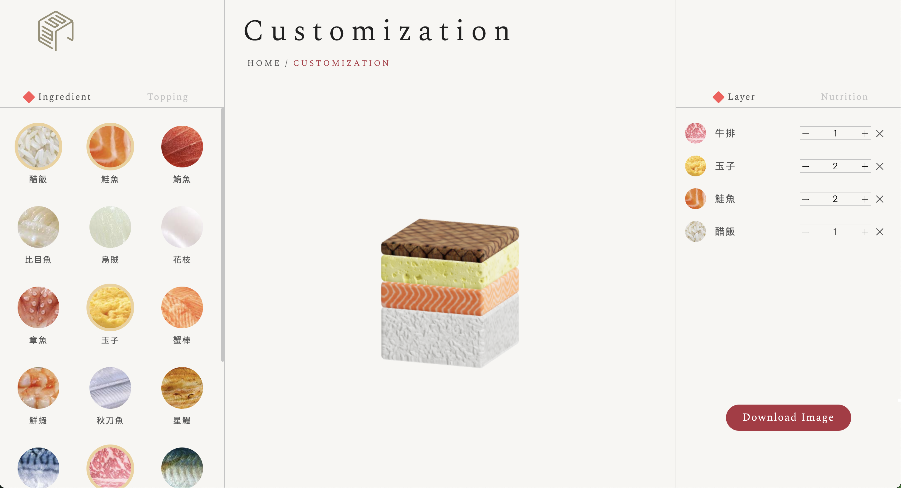

# Sushi Maker

[Sushi Maker](https://sushi-maker-primeal.vercel.app/)

### 這是一個 3D 的壽司編輯器，可以客制食材，份量跟排列，打造符合自己口味及外觀的壽司

## Summary

- 使用者可以在左欄挑選食材，並在右欄加減食材的份量及拖移改變排列順序，中間預覽區可以旋轉及放大

1. 運用 framer motion, Three.js 製作 web 3D 展示
2. Drag and Drop funciotn 結合 3D 排列高度計算
